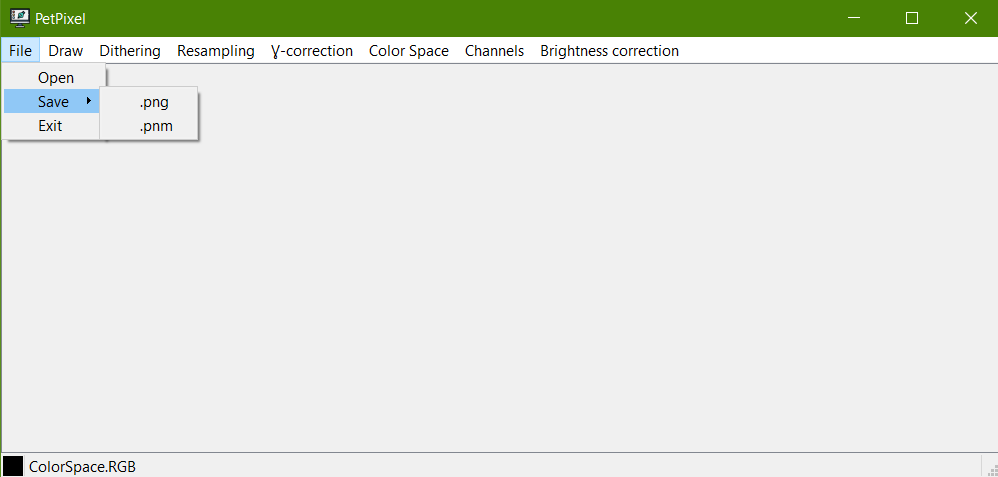
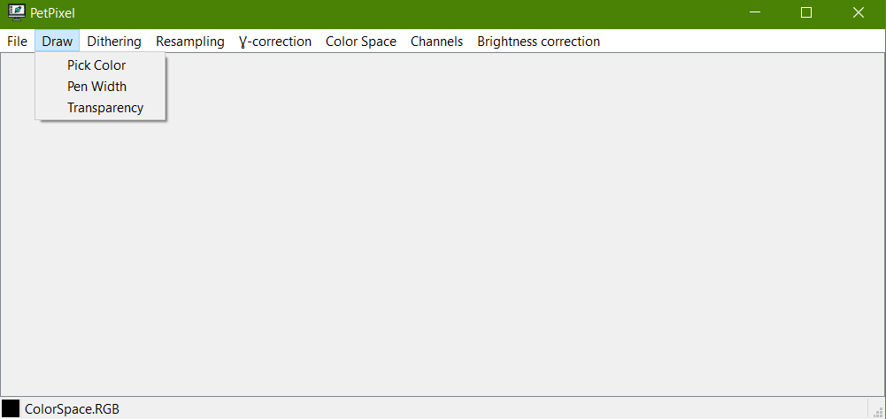
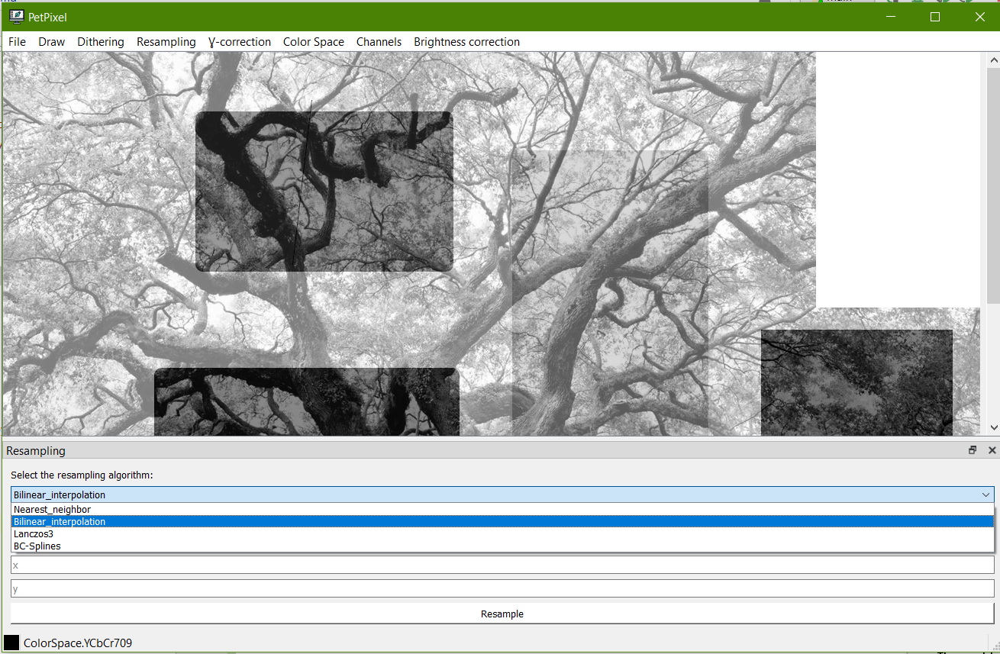
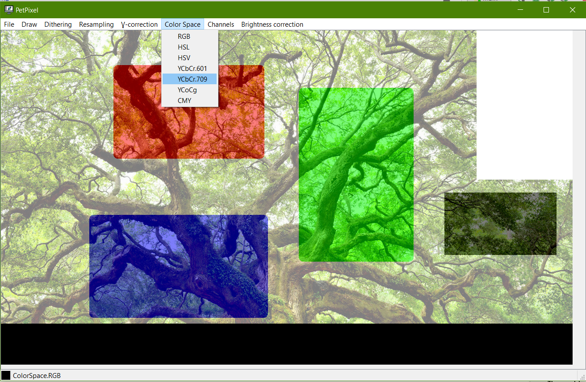
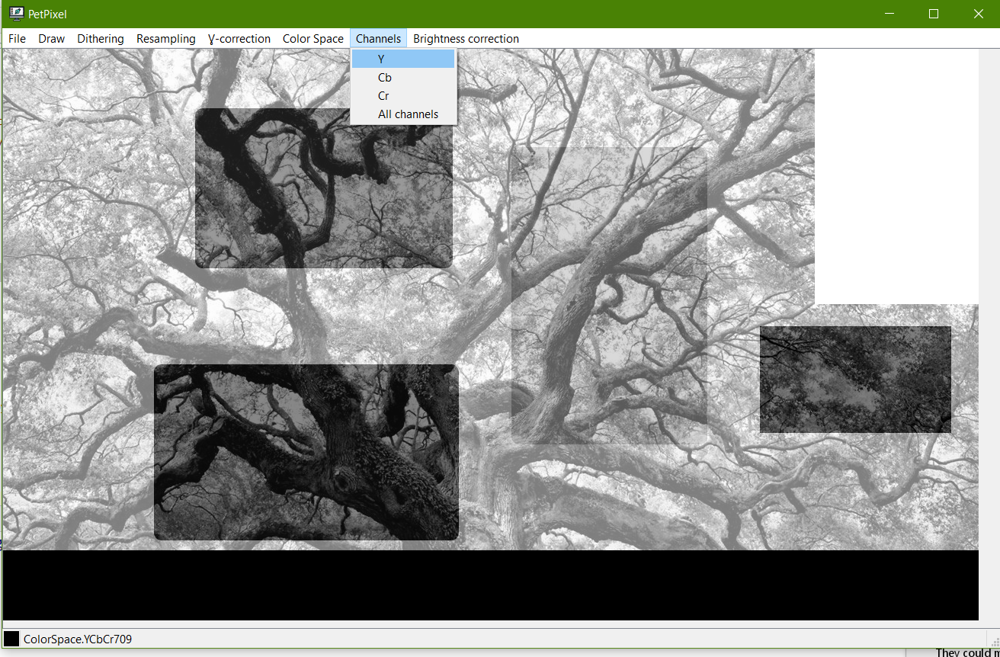

# custom-grafic-editor

Приложение для редактирования изображений в формате .pnm.

## Functionality

### About .pnm format

* PNM (или portable pixmap) - это формат хранения изображений, включающий в себя цветные (PPM), полутоновые (PGM) и чёрно-белые (PBM) представления.

### Interface

На верхней горизонтальной панели меню расположенены вкладки с кнопками следующей функциональности:
* _File_ содержит кнопки _Open_ (открытие .pnm файла), _Save_ (сохранение текущего открытого файла в двух форматах на выбор) и _Exit_ (закрытие приложения).

* Draw содержит кнопки, позволяющие задать параметры рисования: Цвет, Ширину линии и Степень прозрачности.
  Выбранный цвет отображается на нижней информационной панели.

* В приложении поддерживается гамма-коррекция

* Resampling открывает дополнительную вкладку с параметрами масштабирования. На выбор предоставлены четыре алторитма масштабирования. Кроме новых высоты и ширины, можно задать _x_ и _y_ - сдвиги по вертикали и горизонтали.

* ColorSpace содержит кнопки перехода между различными цветовыми пространствами. Посмотреть текущее можно на нижней информационной панели.

* Приложение также поддерживает просмотр одного из каналов, набор которых отличается для различных цветовых пространств.

_Прим: При сохранении учитывается текущее цветовое пространство и выбранный канал, изображение сохраняется именно в них_

* Коррекция яркости включает в себя получение диаграмм, ввод коэффициента, анализ диаграммы с применением коэффициента и коррекцию с изменением изображения.

* Dithering можно выполнить на текущем открытом изображении или автоматически создаваемом градиенте.

## Getting Started

### Installing

Библиотеку можно установить с помощью [pip](https://pip.pypa.io/en/stable/)

Установка библиотеки из архива, предварительно скачанного из данного репозитория

    $ pip install ./downloads/custom-graphic-editor.tar.gz

Установка по ссылке из репозитория

    $ pip install -e custom-graphic-editor @ git+https://git.repo/custom-graphic-editor.git

## Authors

  - **Mila Petrenko** - [petmila](https://github.com/petmila)
